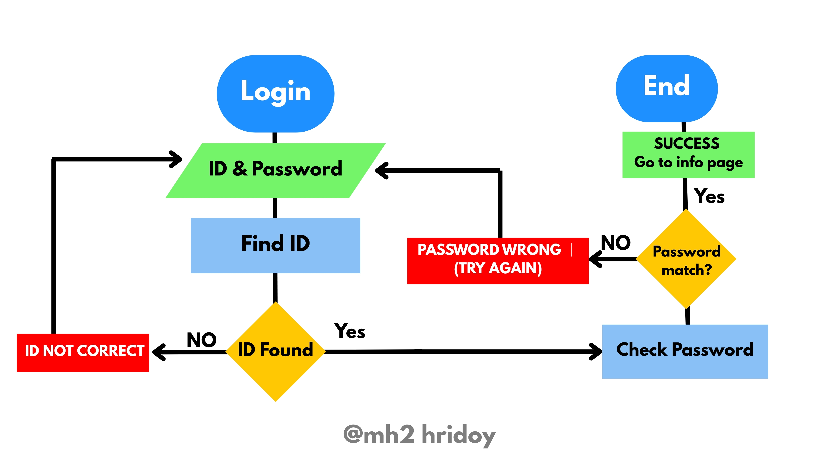

### uplode date : 29 March 2026 - Project work pending 

# MH2 IT Center Website 🚀


[](https://reactjs.org/)
[](https://tailwindcss.com/)
[](./LICENSE)

A **professional, fully responsive IT training center website** built with **React.js** and **Tailwind CSS**. This website showcases MH2 IT Center’s courses, services, online classes, team, gallery, testimonials, and contact form in a modern, user-friendly layout.

---

## 🔹 Features

- ✅ Fixed **hero section** with cover background image  
- ✅ **About Section** describing the center and its mission  
- ✅ **Services Section** showcasing IT Training, Hardware Repair, IT Consultancy  
- ✅ **Academic System**: Full online classes with live & recorded lectures  
- ✅ **Team Section** highlighting instructors and staff  
- ✅ **Gallery Section** for projects and photos  
- ✅ **Testimonials / Feedback Section**  
- ✅ **Contact Form** integrated for inquiries and enrollment  
- ✅ **Responsive Design** for mobile, tablet, and desktop  
- ✅ Smooth scroll navigation  
- ✅ Modern **color palette:** #000000, #00f6ff, #227480, #BFF167  
- ✅ **Tailwind CSS** for rapid styling  
- ✅ Ready for **GitHub Pages / Netlify / Vercel deployment**

---

## 💻 Tech Stack

- **React.js** - Component-based UI  
- **Tailwind CSS** - Styling & responsive layout  
- **React Router (optional)** - Page navigation  
- **JavaScript (ES6+)**  
- **Optional Backend**: Firebase, Supabase, or any API for courses & testimonials  

---
## flow chart
### student login flow chart



## 📁 Folder Structure

```
pendind 
```
---

# 🎨 Color Palette

Primary Black: #000000

Cyan / Highlight: #00f6ff

Teal / Accent: #227480

Light Green / CTA: #BFF167
